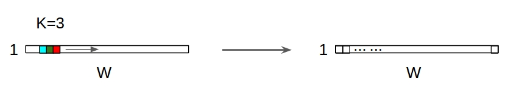
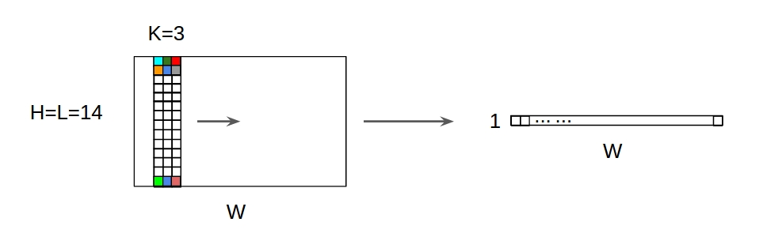
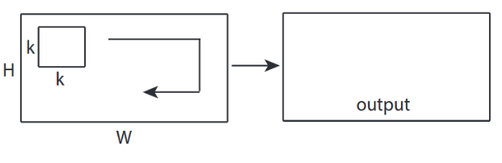
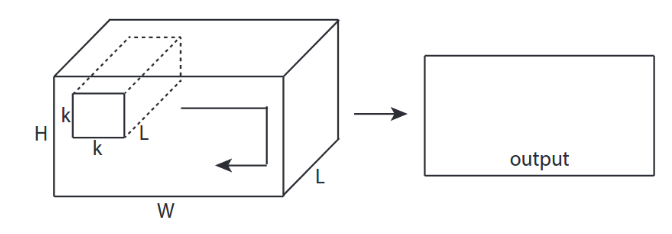
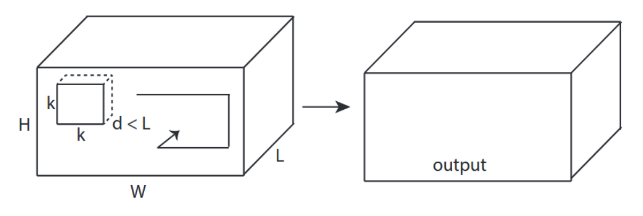

# conv-first-principles
Raw implementations of a convolution layer only using numpy

## Home

### [1D Convolution](https://github.com/lavinama/conv-first-principles/tree/main/conv_1d#readme)
### [2D Convolution](https://github.com/lavinama/conv-first-principles/tree/main/conv_1d#readme)
### [Fully Connected Network](https://github.com/lavinama/conv-first-principles/tree/main/fc_neural_net#readme)

## Convolutions
We are going to study convolutions in dimensions 1D, 2D and 3D

##### 1D Convolution with 1D input

  

**input:** [W], **filter:** [k], **output:** [W']

##### 1D Convolution with 2D input

  

**input:** [W, **L**], **filter:** [k, **L**], **output:** [W]

### 2D Convolution

##### 2D Convolution with 2D input

  

**input:** [W, H], **filter:** [k, k], **output:** [W, H]

##### 2D Convolution with 3D input

  

**input:** [W, H, **L**], **filter:** [k, k, **L**], **output:** [W, H]

### 3D Convolution

##### 3D Convolution with 3D input

  

**input:** [W, H, L], **filter:** [k, k, d], **output:** [W, H, C]

Used as source: [Convolution model - Step by Step - v2](https://datascience-enthusiast.com/DL/Convolution_model_Step_by_Stepv2.html)
