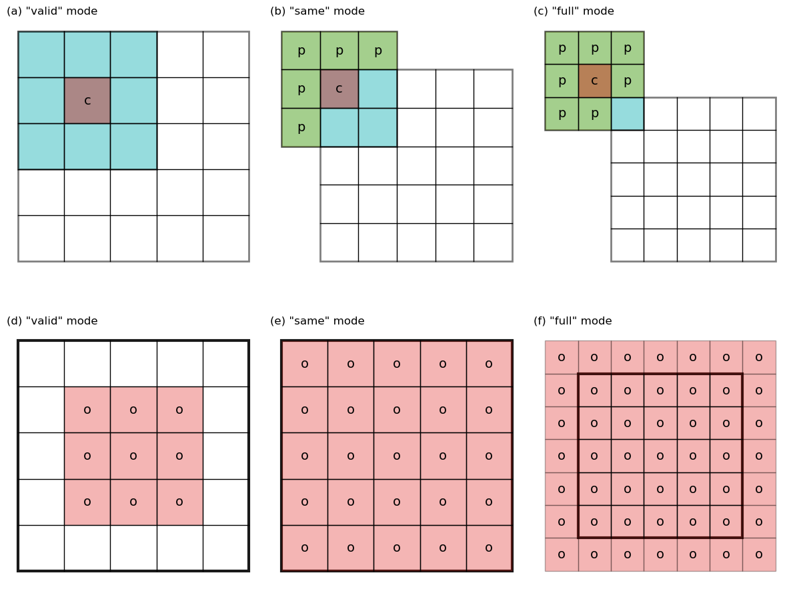

## Table of Contents
1. [Conv_1D components](#conv_1d-components)
  1. `conv_1D_forward`(#conv_1d_forward)
  2. `conv_1D_forward`(#conv_1d_forward)
2. [UNet Architecture](#unet-architecture)
3. [Training](#training)
4. [Dataset](#dataset)
5. [Results](#results)


## Conv_1D components

### `conv_1D_forward`

```python
def conv_1D_single_step(a_slice_prev, W, b):
    # Element-wise product between a_slice and W. Do not add the bias yet.
    s = np.multiply(a_slice_prev,W)
    # Sum over all entries of the volume s.
    Z = np.sum(s)
    # Add bias b to Z. Cast b to a float() so that Z results in a scalar value.
    Z = Z + b.astype(float)
    return Z

def conv_1D_forward(A_prev, W, b=None, hparameters=None):
    # Retrieve dimensions from A_prev's shape
    (m, n_W_in) = A_prev.shape
    # Retrieve dimensions from W's shape
    (f,) = W.shape
    if not b:
        b = np.zeros([1, 1, 1], dtype=np.double)
    if not hparameters:
        hparameters = {}
        hparameters['stride'] = 1
        hparameters['pad'] = 1
    # Retrieve information from "hparameters"
    stride = hparameters['stride']
    pad = hparameters['pad']
    # Compute the dimensions of the CONV output volume using the formula given above. Hint: use int() to floor.
    n_W_out = max(n_W_in, f) - min(n_W_in, f) + 1
    # Initialize the output volume Z with zeros.
    Z = np.zeros([m, n_W_out])
    # Create A_prev_pad by padding A_prev
    A_prev_pad = zero_pad(A_prev, pad)
    # A_prev_pad = A_prev
    for i in range(m):                               # loop over the batch of training examples
        a_prev_pad = A_prev_pad[i,:]                              # Select ith training example's padded activation
        for w in range(n_W_out):                       # loop over horizontal axis of the output volume
            # Find the corners of the current "slice"
            horiz_start = w*stride 
            horiz_end = w*stride + f
            # Use the corners to define the (3D) slice of a_prev_pad.
            a_slice_prev = a_prev_pad[horiz_start:horiz_end]
            # Convolve the (1D) slice with the correct filter W and bias b, to get back one output neuron.
            Z[i, w] = conv_1D_single_step(a_slice_prev, W, b)
    # Making sure your output shape is correct
    assert(Z.shape == (m, n_W_out))
    # Save information in "cache" for the backprop
    cache = (A_prev, W, b, hparameters)
    return Z, cache
```

### `conv_1D_backward`

```python
def conv_1D_backward(dZ, cache):
    # Retrieve information from "cache"
    (A_prev, W, b, hparameters) = cache
    # Retrieve dimensions from A_prev's shape
    (m, n_W_prev) = A_prev.shape
    # Retrieve dimensions from W's shape
    (f,) = W.shape
    # Retrieve information from "hparameters"
    stride = hparameters["stride"]
    pad = hparameters["pad"]
    # Retrieve dimensions from dZ's shape
    (m, n_W) = dZ.shape
    # Initialize dA_prev, dW, db with the correct shapes
    dA_prev = np.zeros((m, n_W_prev))                           
    dW = np.zeros((f, ))
    db = np.zeros((1, ))
    # Pad A_prev and dA_prev
    A_prev_pad = zero_pad(A_prev, pad)
    dA_prev_pad = zero_pad(dA_prev, pad)
    for i in range(m):                       # loop over the training examples
        # select ith training example from A_prev_pad and dA_prev_pad
        a_prev_pad = A_prev_pad[i]
        da_prev_pad = dA_prev_pad[i]
        for w in range(n_W):               # loop over horizontal axis of the output volume
            # Find the corners of the current "slice"
            horiz_start = w
            horiz_end = horiz_start + f
            # Use the corners to define the slice from a_prev_pad
            a_slice = a_prev_pad[horiz_start:horiz_end]
            # Update gradients for the window and the filter's parameters using the code formulas given above
            da_prev_pad[horiz_start:horiz_end] += W[:] * dZ[i, w]
            dW[:] += a_slice * dZ[i, w]
            db[:] += dZ[i, w]
        # Set the ith training example's dA_prev to the unpaded da_prev_pad (Hint: use X[pad:-pad, pad:-pad, :])
        dA_prev[i, :] = da_prev_pad[pad:-pad]
    # Making sure your output shape is correct
    assert(dA_prev.shape == (m, n_W_prev))
    return dA_prev, dW, db
```


## Conv_1D Train

### `train`

```python
def train(X_train, Y_train, X_val=None, Y_val=None, learning_rate = 0.001, learning_rate_decay=0.95,
     num_iters=20, batch_size=4, verbose=False):
    """
    CONV1D -> RELU -> MAXPOOL
    
    Arguments:
    X_train -- training set, of shape (None, 64)
    Y_train -- test set, of shape (None, n_y = 1)
    X_test -- training set, of shape (None, 64)
    Y_test -- test set, of shape (None, n_y = 1)    
    Returns:
    train_accuracy -- real number, accuracy on the train set (X_train)
    test_accuracy -- real number, testing accuracy on the test set (X_test)
    parameters -- parameters learnt by the model. They can then be used to predict.
    """
    np.random.seed(1)                            # to keep results consistent (numpy seed)                       
    num_train = X_train.shape[0]
    iterations_per_epoch = max(num_train / batch_size, 1)
    train_loss_history = []                                        # To keep track of the cost
    val_loss_history = []

    # Create Placeholders of the correct shape
    # X, Y = create_placeholders(n_H0, n_W0, n_C0, n_y)

    # Initialize parameters
    parameters = initialize_parameters()
    
    # performing calculations for subsequent iterations
    for it in range(num_iters):
        random_idxs = np.random.choice(num_train, batch_size)
        X_batch = X_train[random_idxs]
        Y_batch = Y_train[random_idxs]
        # Forward propagation: Build the forward propagation in the tensorflow graph
        Y_hat, memory = forward_propagation(X_batch, parameters)
        
        # calculating metrics and saving them in history
        loss = MSE_loss(Y_hat, Y_batch)
        train_loss_history.append(loss)
        
        # Backpropagation
        grads_values = backward_propagation(Y_hat, Y_batch, memory)
        
        # updating model state
        parameters = update(parameters, grads_values, learning_rate)

        if verbose and it % 5 == 0:
            print('iteration %d / %d: loss %f' % (it, num_iters, loss))
        if X_val and it % iterations_per_epoch == 0:
            Y_val_hat, _ = forward_propagation(X_test, parameters)
            val_loss_history.append(MSE_loss(Y_val_hat, Y_val))
    
    losses = {"train_loss": train_loss_history,
            "val_loss": val_loss_history}
    
    return parameters, losses
```

### `initialize_parameters`

```python
def initialize_parameters():
    np.random.seed(1)                             # so that your "random" numbers match ours        
    W = np.random.randn(3) # (k)
    b = np.random.randn(1) # (1)
    parameters = {"W1": W, "b1": b}
    return parameters
```

### `forward_propagation``

```python
def forward_propagation(X, parameters):
    """
    CONV1D -> RELU    
    Arguments:
    X -- input dataset placeholder, of shape (input size, number of examples)
    parameters -- python dictionary containing your parameters "W1", "W2"
                  the shapes are given in initialize_parameters
    Returns:
    Z3 -- the output of the last LINEAR unit
    """
    # creating a temporary memory to store the information needed for a backward step
    memory = {}
    # X vector is the activation for layer 0 
    A_curr = X
    # Retrieve the parameters from the dictionary "parameters" 
    W1 = parameters["W1"]
    # CONV1D: stride of 1, padding of 1
    Z1, cache = conv_1D_forward(A_curr, W1)
    # saving calculated values in the memory
    memory["cache1"] = cache

    # RELU
    A1 = Z1 * (Z1 > 0)
    memory["A1"] = A1
    
    return A1, memory
```

### `backward_propagation`

```python
def backward_propagation(Y_hat, Y, memory):
    grads_values = {}
    m = Y.shape[1]
    Y = Y.reshape(Y_hat.shape)

    dA_prev = MSE_loss_grad(Y_hat, Y)
    dA_curr = dA_prev

    # calculation of the activation function derivative
    dZ_curr = relu_backward(dA_curr, Y_hat)
    cache1 = memory["cache1"]
    dA_prev, dW_curr, db_curr = conv_1D_backward(dZ_curr, cache1)
    grads_values["dW1"] = dW_curr
    grads_values["db1"] = db_curr

    return grads_values
```

### `update`

```python
def update(params_values, grads_values, learning_rate):
    # iteration over network layers
    params_values["W1"] -= learning_rate * grads_values["dW1"]        
    params_values["b1"] -= learning_rate * grads_values["db1"]
    return params_values
```

### Loss function

#### `MSE_loss`

```python
def MSE_loss(predictions, targets):
    """
    Computes Mean Squared error/loss between targets
    and predictions. 
    Input: predictions (N, k) ndarray (N: no. of samples, k: no. of output nodes)
           targets (N, k) ndarray     (N: no. of samples, k: no. of output nodes)
    Returns: scalar
    Note: The averaging is only done over the output nodes and not over the samples in a batch.
    Therefore, to get an answer similar to PyTorch, one must divide the result by the batch size.
    """
    return np.sum((predictions-targets)**2)/predictions.shape[1]
```

#### `MSE_loss_grad`

```python
def MSE_loss_grad(predictions, targets):
    """
    Computes mean squared error gradient between targets 
    and predictions. 
    Input: predictions (N, k) ndarray (N: no. of samples, k: no. of output nodes)
           targets (N, k) ndarray     (N: no. of samples, k: no. of output nodes)
    Returns: (N,k) ndarray
    Note: The averaging is only done over the output nodes and not over the samples in a batch.
    Therefore, to get an answer similar to PyTorch, one must divide the result by the batch size.
    """
    return 2*(predictions-targets)/predictions.shape[1]
```

### Activation functions

#### `relu`

```python
def relu(Z):
    return np.maximum(0,Z)
```

#### `relu_backward`

```python
def relu_backward(dA, Z):
    dZ = np.array(dA, copy = True)
    dZ[Z <= 0] = 0
    return dZ
```

There are two different types of convolutions for 1D:

<p align="center">
  
</p>

**input:** [$W$], **filter:** [$k$]
### Full
Flips the filter before “sliding” the two across one another until every point has been passed by all the filter values.
**output:** [W + k - 1]

```python
np.convolve([1, 2, 3, 4], [0.5, 1])
>>> [0.5 2.  3.5 5.  4. ]
```

### Same
Flips the filter before “sliding” the two across one another until we reach the final input value.
**output:** [max(W, k)]

```python
np.convolve([1, 2, 3, 4], [0.5, 1], 'same')
>>> [0.5 2.  3.5 5. ]
```

### Valid
Flips the filter before “sliding” the two across one another starting from the first input and until the we reach the final value of the input.
**output:** [max(W, k) - min(W, k) + 1]

```python
np.convolve([1, 2, 3, 4], [0.5, 1], 'valid')
>>> [2.  3.5 5. ]
```
